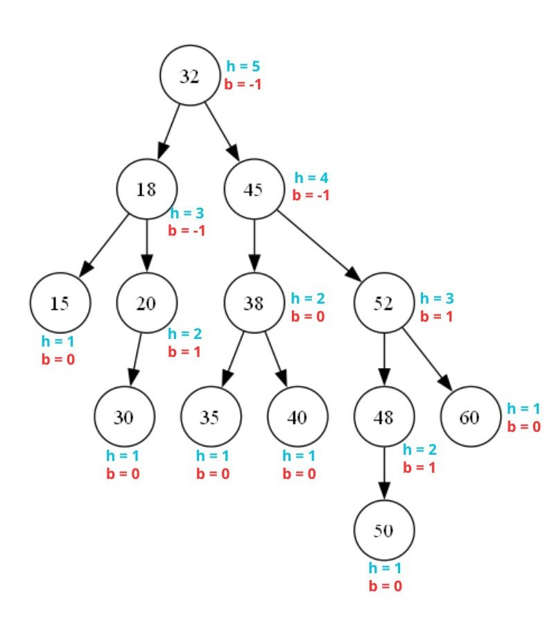

# Sobre
- Implementação das funções de rotação, inserção, remoção e busca em árvores AVL (ArvoreAVL.cpp);
- Execução de testes nos exemplos vistos em sala de aula (testesAVL.cpp);
- Criação de árvore AVL com valores inteiros de uma lista (criacaoAVL.cpp);

## Ambiente Computacional
- Linguagem de programação: C++ (compilador g++ 13.1.0)
- Sistema Operacional: Windows 11
- Hardware: 16 GB DDR4, Ryzen 9 6900HS 3,30 GHz

## Funções Básicas
As funções de rotação, busca, inserção e remoção foram implementadas, com o uso de outras funções auxiliares, para trabalhar com uma arvore AVL. A seguir estão as descrições das implementações:

### Função calcularAltura
Esta função calcula a altura de um nó em uma árvore AVL. A altura de um nó é essencial para determinar o balanceamento da árvore. Se o nó for nulo, retorna 0, representando que nós inexistentes possuem altura zero. Caso contrário, retorna o valor armazenado no campo altura do nó.

### Função calcularBalanceamento
O fator de balanceamento é a diferença entre as alturas das subárvores esquerda e direita de um nó. Um valor positivo indica que a subárvore esquerda é mais alta, enquanto um valor negativo aponta para a subárvore direita ser mais alta. Essa função é usada para verificar se a árvore precisa de rotações para se reequilibrar.

### Função busca
A busca é implementada de forma iterativa, começando pela raiz e navegando pela árvore com base no valor a ser procurado. Se o valor for menor que a chave do nó atual, move-se para a subárvore esquerda, se for maior, para a subárvore direita. Caso encontre o valor, retorna o nó correspondente. Caso contrário, retorna nullptr e imprime uma mensagem indicando que o valor não foi encontrado.

### Função rotacaoEsquerda
Realiza uma rotação simples à esquerda em um nó desbalanceado, ajustando as relações entre a raiz e suas subárvores. O filho direito da raiz torna-se a nova raiz, e o nó original passa a ser o filho esquerdo da nova raiz. As alturas dos nós afetados são atualizadas com base em suas novas subárvores.

### Função rotacaoDireita
Semelhante à rotação à esquerda, mas no sentido oposto. O filho esquerdo da raiz torna-se a nova raiz, e o nó original passa a ser o filho direito da nova raiz. Novamente, as alturas dos nós afetados são recalculadas.

### Função rotacaoDuplaEsquerda
É uma combinação de duas rotações: primeiro, uma rotação simples à direita é aplicada ao filho direito da raiz. Depois, uma rotação simples à esquerda é aplicada ao nó raiz. Isso é necessário quando a subárvore direita-esquerda está desbalanceada.

### Função rotacaoDuplaDireita
Realiza uma rotação dupla para a direita. Primeiro, aplica uma rotação simples à esquerda no filho esquerdo da raiz. Em seguida, uma rotação simples à direita na raiz. Ela corrige desbalanceamentos causados por subárvores esquerda-direita.

### Função inserir
Insere um novo valor na árvore AVL de forma recursiva. Após a inserção, recalcula a altura dos nós e verifica o fator de balanceamento. Caso detecte desbalanceamento, aplica rotações (simples ou duplas) para restaurar o equilíbrio. Diferentes cenários de desbalanceamento são tratados com base na relação entre o valor inserido e os nós da subárvore.

### Função remover
Remove um valor da árvore AVL, ajustando o balanceamento conforme necessário:
1.	Caso base: Se o nó não existe, retorna nullptr.
2.	Busca pela chave: Navega pela árvore para localizar o nó a ser removido.
3.	Remoção de nós:
    - Nó folha (caso 1): Se o nó a ser removido não possui filhos, ele é simplesmente deletado, e a função retorna nullptr, indicando que a posição original agora está vazia.
        
    - Nó com um filho (caso 2): Se o nó a ser removido possui apenas um filho (esquerdo ou direito), o nó é removido e seu único filho é retornado para substituir sua posição na árvore.
        
    - Nó com dois filhos (caso 3): Substitui a chave pela maior chave da subárvore esquerda e remove o nó correspondente.
4.	Após a remoção, recalcula a altura e o balanceamento, aplicando rotações para reequilibrar a árvore.

### Testes
As funções foram testadas nos exemplos vistos em sala, sendo aplicadas nas arvores trabalhadas nos slides de aula. A função principal do arquivo “testesAVL.cpp” executa os testes das funções básicas e imprime os resultados em nível.

## Criação de Árvore e Representação Gráfica
Foi implementada a função criarAVL(), responsável por construir a árvore AVL especificada, utilizando a função de inserção para inserir os valores inteiros da lista L={15, 18, 20, 35, 32, 38, 30, 40, 32, 45, 48, 52, 60, 50}. Em seguida, a árvore é exportada para um arquivo .dot, que contém sua representação gráfica. Esse arquivo pode ser utilizado por ferramentas como o Graphviz para visualizar a estrutura da árvore. No diretório do projeto, o arquivo "fromVector.png" exibe a representação gráfica gerada. Análise da criação da arvore:

<div align="center">
    
</div>

Podemos observar que a criação da árvore foi bem-sucedida. Graças ao uso das funções de rotação e verificação de balanceamento, o algoritmo conseguiu construir uma árvore que mantém as propriedades de uma AVL. Isto é, em cada nó, o fator de balanceamento b (definido como a diferença entre as alturas das subárvores esquerda e direita) está restrito ao intervalo de -1 a 1. É importante ressaltar que a implementação criada da função de inserção não considera repetições, logo o numero 32 da lista L é inserido apenas uma vez.

## Executar Testes
Compilação:
```
g++  ArvoreAVL.cpp testesAVL.cpp -o testes
```

Execução:
```
./testes
```

## Criar Árvore (com representação gráfica)
Compilação:
```
g++  ArvoreAVL.cpp criacaoAVL.cpp -o criacao
```

Execução:
```
./criacao
```

Visualização em PNG:
```
dot -Tpng fromVector.dot -o fromVector.png
```