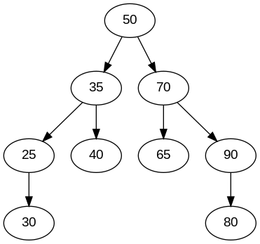
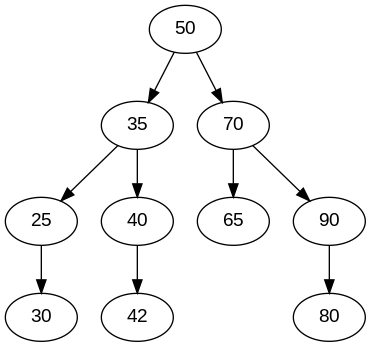
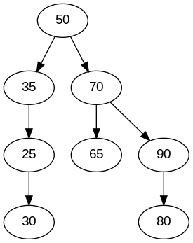
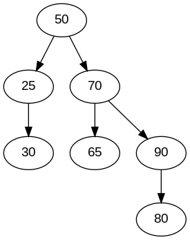
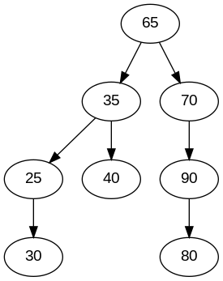
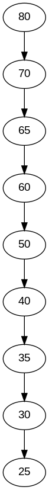
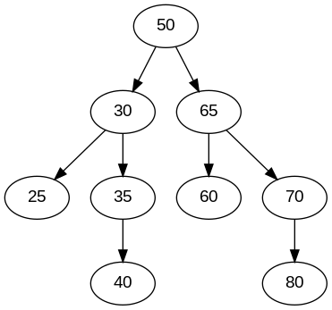

# Árvore Binária de Busca (Binary Search Tree - BST)

Este projeto implementa uma Árvore Binária de Busca com suporte às seguintes operações:

- **Inserção**
- **Busca**
- **Remoção**
- **Percursos**:
  - Pré-ordem
  - Ordem simétrica 
  - Pós-ordem
  - Por nível
- **Balanceamento**: Foi implementada uma estratégia de balanceamento para melhorar a eficiência da árvore para evitar pior caso.

Além disso, foram realizados testes (baseados em exemplos vistos em sala de aula) para verificar a funcionalidade das operações implementadas. O **Graphviz** foi utilizado para gerar representações visuais das árvores resultantes.

---

## Ambiente Computacional

- **Linguagem utilizada**: C++ com o compilador gcc 13.3.0.
- **Hardware**:
  - 16 GB RAM DDR4
  - AMD® Ryzen 7 5700X3D (8 núcleos, 16 threads)
  - GeForce RTX™ 4060 Ti (8 GB GDDR6)
- **Sistema Operacional**: Ubuntu 22.04.5 LTS (64 bits)
- **Editor de código**: Visual Studio Code

---
## Estrutura do Projeto

- **Arquivos principais**:
  - `BinarySearchTree.cpp` – Implementação da árvore binária.
  - `BinarySearchTree.h` – Declaração dos métodos da Classe da árvore binária.
  - `testes_bst.cpp` – Arquivo de testes que valida as operações realizadas na árvore binária.
- **Saídas visuais**:
  - Arquivos `.dot` gerados para representação gráfica das árvores.

---

## principais funções 
### Inserção 
A função responsável pela inserção de nós na Árvore binária é a `insert(int item)`. Primeiro ela cria um novo nó e verifica se a árvore está vazia, se estiver, o novo nó se torna a raiz da árvore. Caso contrário, percorre a árvore comparando o valor de cada nó com o valor do novo nó, se o item for menor ele vai para subárvore da esquerda, caso seja maior vai para a subárvore da direita. quando encontra a posição desejada insere o novo nó.

### Exemplos de Inserção em Árvore Binária

| **Árvore Original**                | **Árvore Após Inserção**           |
|------------------------------------|------------------------------------|
|  |  |

### Busca 

A função de busca foi implementada de forma iterativa em `search(node* currentRoot, int item)`. Começando da raiz, enquanto o nó atual não for nulo e o item não for encontrado ele entra em dois casos: se o item for menor percorre a subárvore da esquerda ou se o item for maior percorre a subárvore da direita. No final retorna o nó ou `null` caso não encontre.

### Remoção

A função `remove(node*& currentNode, int item)` responsável pela remoção de nós da árvore, ela cobre os 3 casos. No primeiro caso onde o nó é uma folha ou seja não possuiu filhos, ela remove o nó diretamente ajustando para `null`. No segundo caso o nó possuiu um filho, ele substitui o nó a ser removido pelo seu filho e no terceiro e ultimo caso, o nó possuiu dois filhos nesse caso utilizando a função `successor()` para encontrar o menor valor da subárvore direita, ele substitui o valor do nó pelo sucessor e remove o nó da árvore.

### Exemplos de Remoção em Árvore Binária

|**Casos**                            | **Árvore Original**                | **Árvore Após Remoção**           |
|-------------------------------------|------------------------------------|------------------------------------|
| Nó folha removido                   |   |  |
| Nó com um filho removido            |   |  |
| Nó com dois filhos removido         |   |  |

### Estratégia de balanceamento
Um problema comum das árvores binárias é que, dependendo da ordem da lista de entrada, a árvore pode acabar perdendo sua estrutura balanceada e se tornando semelhante a uma lista. Isso ocorre, por exemplo, quando todos os valores da lista são sempre maiores em sequência, fazendo com que os elementos sejam inseridos apenas à esquerda. Da mesma forma, se os valores forem menores, eles podem ser inseridos à direita, ou até mesmo a árvore pode se tornar uma estrutura "zig-zag".

Para evitar esse problema, implementei um método simples de balanceamento chamado `createBalancedTree()`. A ideia consiste em ordenar a lista antes de inseri-la na árvore. O próximo passo é calcular o elemento central dessa lista. Esse elemento central será usado como raiz da árvore, e os elementos à esquerda e à direita serão os filhos da raiz. O processo se repete recursivamente até que todos os elementos sejam inseridos na árvore de maneira balanceada.

### Exemplos de Balanceamento de Árvore Binária

| **Árvore Não Balanceada**          | **Árvore Balanceada**              |
|------------------------------------|------------------------------------|
|  |  |

---

## Compilar e executar

Para Compilar os testes:

```bash
g++ testes_bst.cpp BinarySearchTree.cpp -o testes
```
para executar os testes: 
```bash
./testes
```
## Visualizar árvores

Após compilar e executar os testes, o terminal exibirá cada teste, mostrando todas as formas de percursos implementadas. Além disso, também serão gerados arquivos .dot para visualizar cada teste de forma mais simples. Para gerar as imagens, utilize:

```bash
dot -Tpng tree_insert_T1.dot -o tree_insert_T1.png
dot -Tpng tree_insert_T1_42.dot -o tree_insert_T1_42.png
dot -Tpng tree_insert_T2.dot -o tree_insert_T2.pngA
dot -Tpng tree_insert_T2_32.dot -o tree_insert_T2_32.png
dot -Tpng tree_insert_T3.dot -o tree_insert_T3.png
dot -Tpng tree_insert_T3_28.dot -o tree_insert_T3_28.png
dot -Tpng tree_insert_T4.dot -o tree_insert_T4.png
dot -Tpng tree_insert_T4_balanced.dot -o tree_insert_T4_balanced.png
dot -Tpng tree_remove_T1.dot -o tree_remove_T1.png
dot -Tpng tree_remove_T1_40.dot -o tree_remove_T1_40.png
dot -Tpng tree_remove_T2.dot -o tree_remove_T2.png
dot -Tpng tree_remove_T2_35.dot -o tree_remove_T2_35.png
dot -Tpng tree_remove_T3.dot -o tree_remove_T3.png
dot -Tpng tree_remove_T3_50.dot -o tree_remove_T3_50.png
dot -Tpng tree_search.dot -o tree_search.png
```
